# ParkVision 智能停车系统测试报告

项目名称：ParkVision-System 智能停车 CPS 演示系统  
测试主题：系统测试、功能性测试、静态测试、黑盒测试、白盒测试、非功能测试与可用性测试
测试日期：2026-05-18  
报告修订日期：2026-05-19
测试环境：本地 Windows 环境，前端预览服务 `http://localhost:5173`，后端服务 `http://localhost:8080`  
测试结论：本轮系统测试通过。功能测试 `12/12` 通过，黑盒异常测试 `5/5` 通过，性能测试所有场景成功率 `100%`。

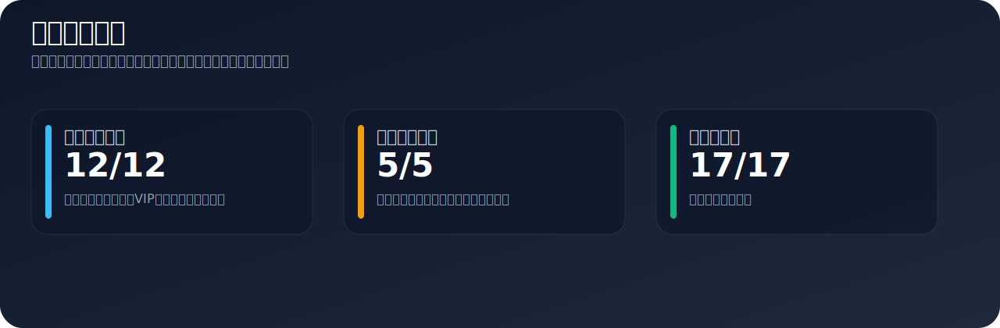

## 1. 测试目标

本轮测试目标是证明 ParkVision 已经具备完整系统级演示能力，而不是停留在前端静态页面或单点模拟数据。测试重点如下：

| 编号 | 测试目标 | 验证方式 | 结论 |
|---|---|---|---|
| T-01 | 验证真实数据链路 | 前端页面调用后端 API，后端读取 H2 文件数据库 | 通过 |
| T-02 | 验证业务闭环 | 入场、订单、车位、调度、取车、支付、计费、导航、报表联动 | 通过 |
| T-03 | 验证设备模拟链路 | 摄像头、闸机、充电桩、AGV 由后端统一模拟状态 | 通过 |
| T-04 | 验证异常处理能力 | 非法订单号、缺少参数、急停恢复等黑盒用例 | 通过 |
| T-05 | 验证服务层分支 | 订单状态变更、急停控制、异常分支的白盒覆盖 | 通过 |
| T-06 | 验证非功能表现 | 接口并发压测、可启动性、持久化、可观测性 | 通过 |
| T-07 | 形成汇报证据 | 生成截图、流程图、性能图、Markdown 报告和 PDF | 通过 |

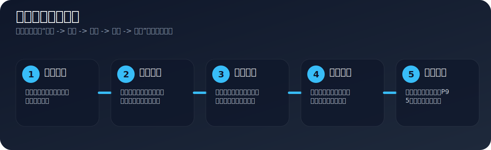

## 2. 测试范围

### 2.1 被测系统模块

| 模块 | 前端页面 | 后端接口/服务 | 测试重点 |
|---|---|---|---|
| 运营首页 | 运营首页 | `/api/dashboard/summary`, `/api/forecast/traffic`, `/api/slots` | KPI、交通预测、车位状态、事件流 |
| AI 感知 | AI Vision | `/api/edge/vision/infer`, `/api/devices/overview` | 车牌识别、入侵检测、急停联动 |
| 调度中心 | 调度中心 | `/api/dispatch/queue`, `/api/dispatch/agvs`, `/api/dispatch/pre-dispatch`, `/api/dispatch/vip` | 预调度、VIP 插队、AGV 状态 |
| 数字孪生 | 数字孪生 | `/api/slots`, `/api/dispatch/agvs`, `/api/devices/overview` | 车位、AGV、闸机、急停状态可视化 |
| 车主端 | 车主端 | `/api/orders`, `/api/orders/{orderNo}/retrieve`, `/touch-and-go`, `/pay` | 取车、临时取物、支付关闭订单 |
| 动态计费 | 动态计费引擎 | `/api/pricing/preview`, `/api/admin/pricing-rules` | 按订单、时长、峰值、充电、VIP 计算费用 |
| 室内导航 | 室内导航 | `/api/navigation/indoor` | 交接区导航、ETA、AGV 同步、安全提示 |
| 管理台 | 管理报表与台账 | `/api/admin/orders`, `/alerts`, `/pricing-rules`, `/access-list`, `/report` | 订单、告警、规则、名单、AI 报表 |
| 系统配置 | 系统网关与设备 | `/api/system/nodes`, `/api/devices/overview` | 节点健康、设备列表、设备事件 |

### 2.2 本轮范围边界

| 内容 | 当前处理方式 | 说明 |
|---|---|---|
| 真实物理摄像头、闸机、PLC、AGV | 后端模拟真实协议风格数据 | 项目没有实体硬件，本轮用 ONVIF、Modbus/TCP、OCPP 风格字段模拟设备接入 |
| 外部 MySQL 服务 | 默认 H2 文件数据库 | 仓库拉取后无需手工建库，首次启动自动生成 `backend/data/parkvision.mv.db` |
| 第三方支付回调 | 后端订单状态模拟 | 当前验证支付完成后的订单关闭、金额计算和车位释放，不接真实支付网关 |
| 登录鉴权 | 暂未接入 | 当前安全测试聚焦输入校验、业务异常和急停安全联动；生产化需补角色权限和审计 |

## 3. 测试环境

| 项目 | 配置 |
|---|---|
| 操作系统 | Windows 本地开发环境 |
| 前端 | Vue 3 + Vite，预览端口 `5173` |
| 后端 | Spring Boot 3.4.1，服务端口 `8080` |
| 数据库 | H2 文件数据库，路径 `backend/data/parkvision.mv.db` |
| Java | 项目要求 Java 17+，本机运行日志显示 Java 25 |
| Node.js | v22.17.1 |
| 截图工具 | Playwright headless Chromium |
| PDF 导出 | Markdown 转 HTML，再由无头 Chromium 导出 PDF |
| 设备模式 | 后端模拟现场设备 |

启动命令：

```powershell
powershell -ExecutionPolicy Bypass -File .\start.ps1 -Mode preview -Detached -NoInstall
```

健康检查结果：

| 检查项 | 结果 |
|---|---|
| 后端 `/actuator/health` | `UP` |
| 前端首页 `http://localhost:5173` | HTTP `200` |
| 数据库模式 | H2 文件数据库 |
| 设备模式 | 后端模拟现场设备 |

## 4. 测试数据规模

以下数据来自系统测试执行后的数据库快照和接口返回。

| 数据对象 | 数量 | 说明 |
|---|---:|---|
| 车位 | 72 | 覆盖空位、占用、缓存、充电、维护等状态 |
| 订单 | 31 | 含历史订单、进行中订单、新增测试订单 |
| 调度任务 | 25 | 含标准取车、预调度、VIP、临时取物等任务 |
| AGV | 4 | 含坐标、电量、速度、载车状态、任务状态 |
| 告警 | 11 | 含安全、设备、订单和闸机告警 |
| 名单 | 12 | 含白名单、黑名单、观察名单和普通名单 |
| 计费规则 | 4 | 含 VIP、夜间包时、工作日阶梯、新能源充电 |
| 设备事件 | 10 | 覆盖摄像头、闸机、充电桩、AGV、调度事件 |
| 摄像头 | 3 | 模拟 ONVIF Profile T 字段 |
| 闸机 | 3 | 模拟 Modbus/TCP 风格状态 |
| 充电桩 | 3 | 模拟 OCPP 风格状态 |

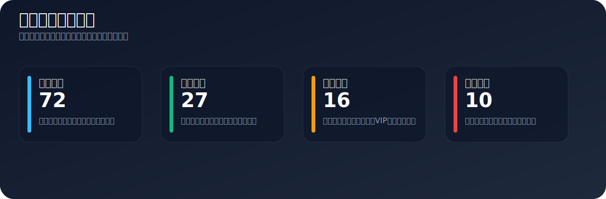

## 5. 需求测试

### 5.1 功能性需求

| 需求编号 | 目标用户 | 子系统 | 需求 | 完整性 | 正确性 | 一致性 | 可行性 | 必要性 | 可测试性 | 可追踪性 |
|---|---|---|---|---|---|---|---|---|---|---|
| R1.1.1 | 运营人员 | 运营首页 | 展示车位占用率、今日车流、AGV 在线数、告警数与交通预测 | 完整 | 正确 | 一致 | 可行 | 必要 | 可测试 | 可追踪 |
| R1.2.1 | 车主 | 订单服务 | 车辆入场后创建停车订单并占用真实车位 | 完整 | 正确 | 一致 | 可行 | 必要 | 可测试 | 可追踪 |
| R1.2.2 | 车主 | 车主端 | 支持取车、临时取物、支付完成并关闭订单 | 完整 | 正确 | 一致 | 可行 | 必要 | 可测试 | 可追踪 |
| R1.3.1 | 调度员 | 调度中心 | 支持标准取车、预调度、VIP 优先和临停取物队列 | 完整 | 正确 | 一致 | 可行 | 必要 | 可测试 | 可追踪 |
| R1.4.1 | 安全员 | AI 感知 | 识别车牌、置信度和入侵事件，入侵时触发急停 | 完整 | 正确 | 一致 | 可行 | 必要 | 可测试 | 可追踪 |
| R1.5.1 | 管理员 | 管理台 | 查询订单、告警、名单、计费规则并生成 AI 报表 | 完整 | 正确 | 一致 | 可行 | 必要 | 可测试 | 可追踪 |
| R1.6.1 | 车主 | 室内导航 | 返回接驳点、剩余距离、车主 ETA、AGV ETA 与安全提示 | 完整 | 正确 | 一致 | 可行 | 必要 | 可测试 | 可追踪 |

### 5.2 非功能性需求

| 需求编号 | 目标用户 | 类型 | 需求 | 完整性 | 正确性 | 一致性 | 可行性 | 必要性 | 可测试性 | 可追踪性 |
|---|---|---|---|---|---|---|---|---|---|---|
| R2.1.1 | 开发/测试 | 可启动性 | 前后端可通过脚本一键启动，健康检查返回 UP | 完整 | 正确 | 一致 | 可行 | 必要 | 可测试 | 可追踪 |
| R2.1.2 | 开发/测试 | 持久化 | 首次启动自动建库并写入 H2 文件数据库 | 完整 | 正确 | 一致 | 可行 | 必要 | 可测试 | 可追踪 |
| R2.2.1 | 使用者 | 性能 | 核心接口在并发压测下保持 100% 成功率和可接受响应时间 | 完整 | 正确 | 一致 | 可行 | 必要 | 可测试 | 可追踪 |
| R2.3.1 | 使用者 | 可靠性 | 非法订单、缺参请求和急停恢复均有明确处理路径 | 完整 | 正确 | 一致 | 可行 | 必要 | 可测试 | 可追踪 |
| R2.4.1 | 管理人员 | 可观测性 | 节点、摄像头、闸机、充电桩、事件与告警可视化展示 | 完整 | 正确 | 一致 | 可行 | 必要 | 可测试 | 可追踪 |
| R2.5.1 | 教师/评审 | 可用性 | 页面导航清晰，截图证据覆盖主要演示链路 | 完整 | 正确 | 一致 | 可行 | 必要 | 可测试 | 可追踪 |
| R2.6.1 | 安全员 | 安全边界 | 急停可锁定闸机和节点，接口异常返回结构化错误 | 完整 | 正确 | 一致 | 可行 | 必要 | 可测试 | 可追踪 |

## 6. 功能性测试

功能性测试共设计 12 个自动化验证点，执行结果 `12/12` 通过。为对齐参考 PPT，本报告将功能测试拆分为 4 组测试用例表。

### 6.1 功能测试用例表（一）：运营与订单

| 功能模块 | 用例 | 用例编号 | 用例说明 | 前置条件 | 输入/动作 | 预期结果 | 测试结果 | 失败原因 |
|---|---|---|---|---|---|---|---|---|
| 运营首页 | 数据展示 | T1.1.1 | 进入运营首页，查看 KPI、车位概览、交通预测和事件流 | 前后端启动，数据库已初始化 | 打开 `/dashboard` | 页面显示真实统计、车位和预测数据 | 通过 | 无 |
| 订单服务 | 车辆入场 | T1.1.2 | 车辆入场后创建订单并绑定空闲车位 | 存在空闲车位 | 输入车牌 `SH-K1314`，调用入场接口 | 订单状态为 `PARKED`，空位数减少，车位变为占用 | 通过 | 无 |
| 调度中心 | 预调度 | T1.1.3 | 高峰期提前移动车辆，生成预调度任务 | 订单已停放 | 执行高峰预调度动作 | 队列头部新增预调度任务，任务来源可追踪 | 通过 | 无 |
| 调度中心 | 标准取车 | T1.1.4 | 车主发起取车后进入调度队列 | 订单状态为 `PARKED` | 点击取车或调用 `retrieve` 接口 | 订单变为 `RETRIEVING`，生成标准取车任务 | 通过 | 无 |

运营首页截图：

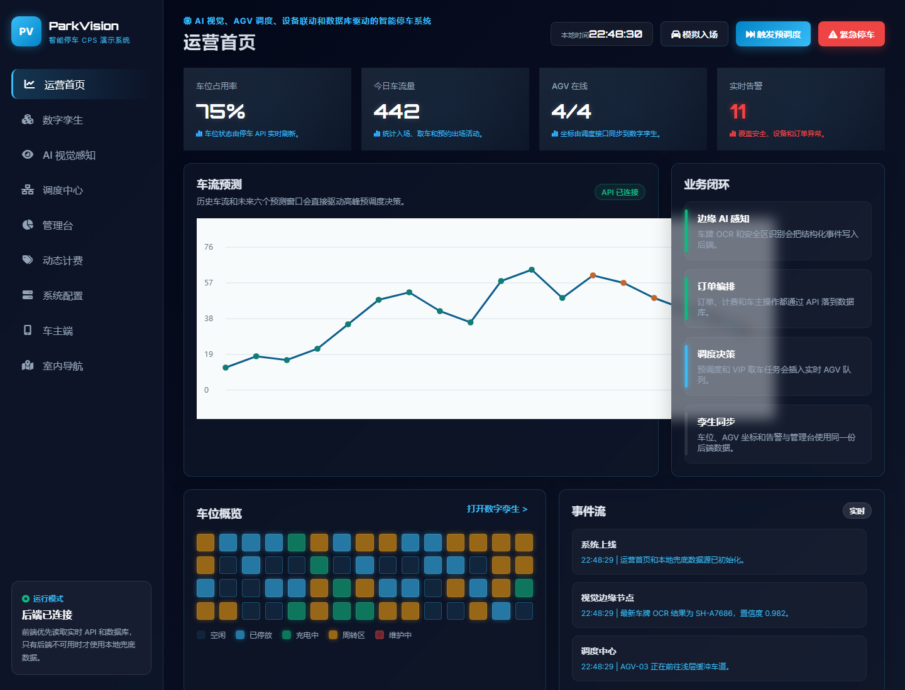

调度中心截图：

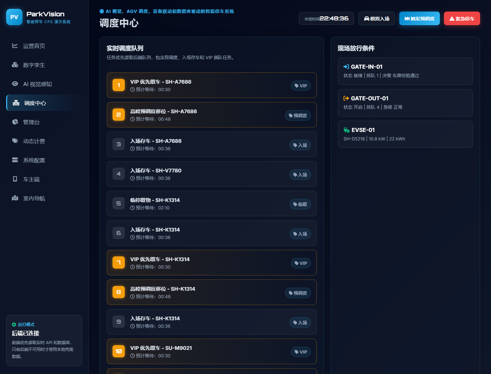

### 6.2 功能测试用例表（二）：AI 感知与安全联动

| 功能模块 | 用例 | 用例编号 | 用例说明 | 前置条件 | 输入/动作 | 预期结果 | 测试结果 | 失败原因 |
|---|---|---|---|---|---|---|---|---|
| AI 感知 | 正常识别 | T1.2.1 | 采集画面后返回车牌、置信度、摄像头 ID 和动作建议 | 摄像头在线 | 点击采集画面，`intrusion=false` | 返回 OCR 结果，系统不进入急停 | 通过 | 无 |
| AI 感知 | 入侵急停 | T1.2.2 | 检测到交接区入侵后触发系统急停 | 摄像头在线，闸机在线 | 点击检测入侵，`intrusion=true` | 摄像头 ROI 风险、闸机急停、节点 `warning`、告警新增 | 通过 | 无 |
| 数字孪生 | 急停展示 | T1.2.3 | 数字孪生页面展示安全联动后的 AGV、车位、闸机状态 | 急停已触发 | 打开数字孪生页面 | 急停状态与正常孪生页面有明显差异 | 通过 | 无 |
| 设备控制 | 解除急停 | T1.2.4 | 人工解除急停后设备恢复自动模式 | 系统处于急停 | 调用 `emergency active=false` | 闸机解除锁定，节点恢复稳定，事件流记录解除动作 | 通过 | 无 |

AI 感知截图：

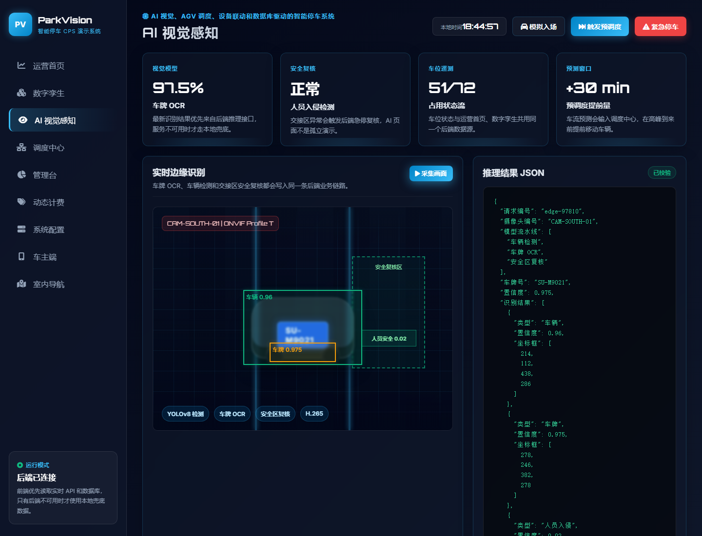

数字孪生与急停截图：

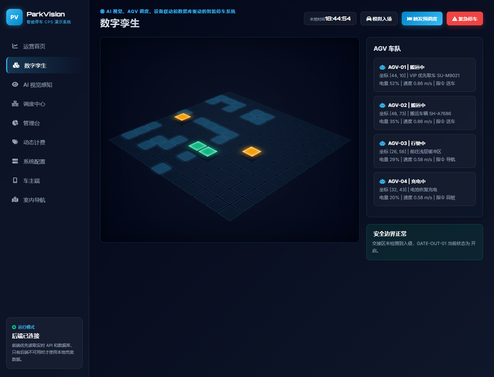

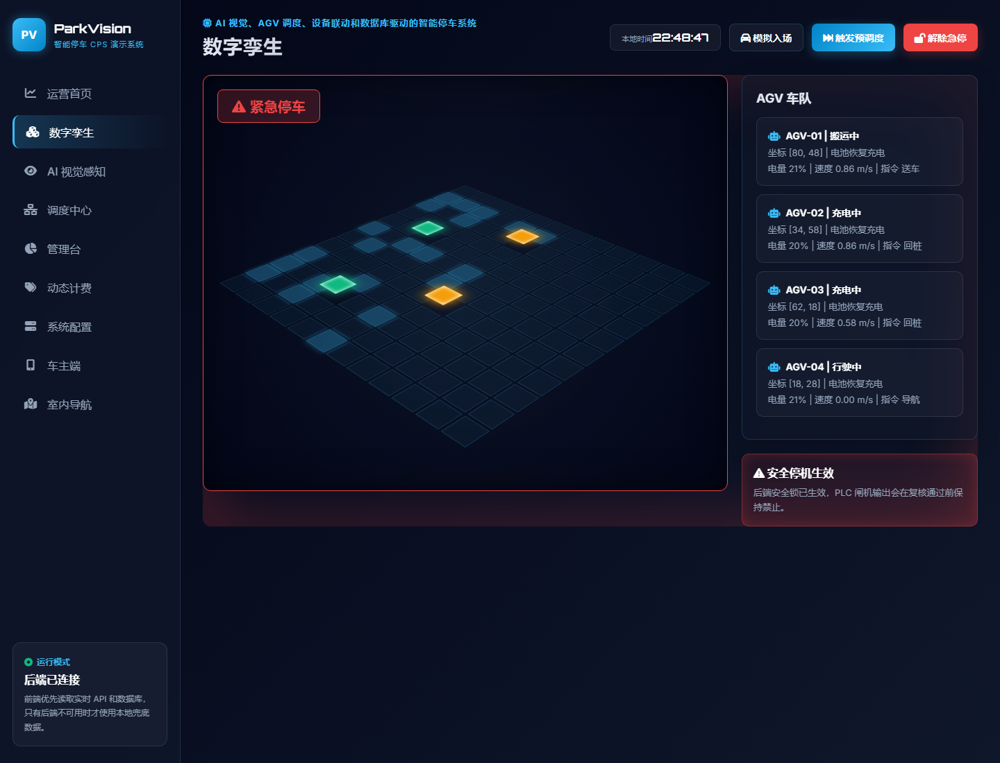

### 6.3 功能测试用例表（三）：车主端、计费与导航

| 功能模块 | 用例 | 用例编号 | 用例说明 | 前置条件 | 输入/动作 | 预期结果 | 测试结果 | 失败原因 |
|---|---|---|---|---|---|---|---|---|
| 车主端 | 当前订单 | T1.3.1 | 车主端展示当前停车订单、车位和状态 | 存在进行中订单 | 打开车主端页面 | 可看到订单号、车牌、车位、状态和可执行动作 | 通过 | 无 |
| 车主端 | 临时取物 | T1.3.2 | 车主发起临时取物后车辆进入缓冲区 | 订单处于 `PARKED` | 点击临时取物 | 订单变为 `TOUCHING`，车位变为 `BUFFER` | 通过 | 无 |
| 车主端 | 支付关闭 | T1.3.3 | 支付完成后关闭订单并释放车位 | 订单待支付 | 点击标记已支付并关闭订单 | 订单 `FINISHED`，金额生成，车位释放为空位 | 通过 | 无 |
| 动态计费 | 费用预览 | T1.3.4 | 根据订单时长、峰值、充电和 VIP 规则计算费用 | 存在有效订单 | 打开计费页并预览 | 返回计费组成、规则解释和总金额 | 通过 | 无 |

车主端、计费和室内导航截图：

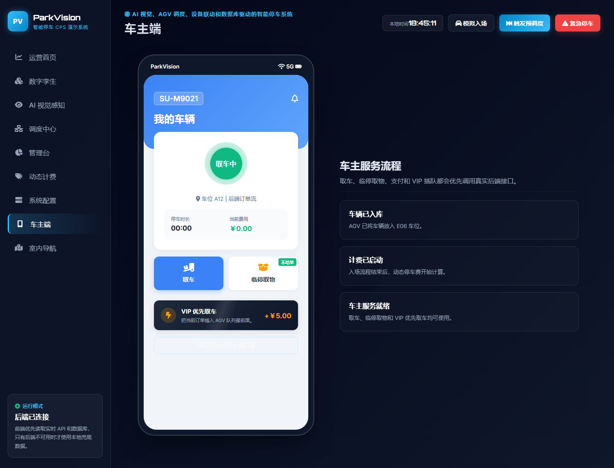

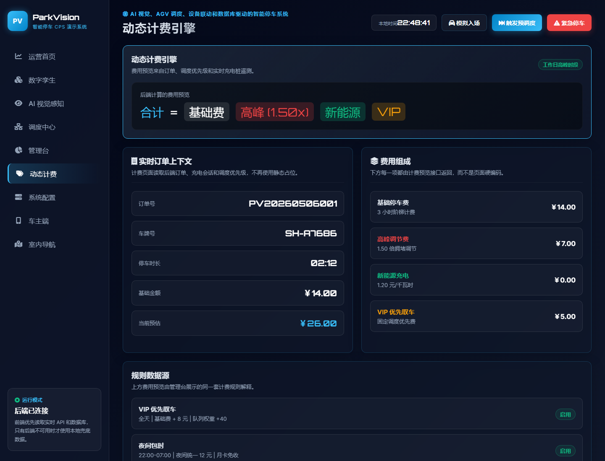

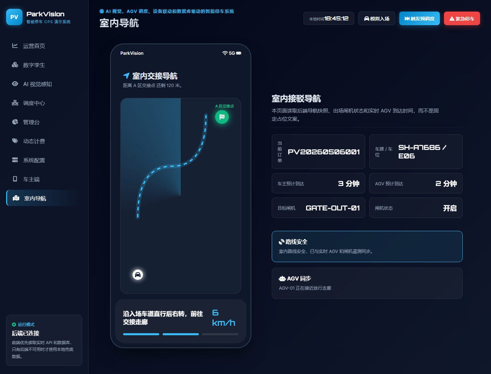

### 6.4 功能测试用例表（四）：管理台与系统设备

| 功能模块 | 用例 | 用例编号 | 用例说明 | 前置条件 | 输入/动作 | 预期结果 | 测试结果 | 失败原因 |
|---|---|---|---|---|---|---|---|---|
| 室内导航 | 接驳路线 | T1.4.1 | 返回接驳点、剩余距离、车主 ETA、AGV ETA 与安全提示 | 存在有效订单 | 打开室内导航页 | 路线快照、ETA 和提示信息完整展示 | 通过 | 无 |
| 管理台 | 订单列表 | T1.4.2 | 管理员查看订单表并核对订单状态 | 数据库存在订单 | 打开管理台订单页 | 订单表来自 `/api/admin/orders`，数据非空 | 通过 | 无 |
| 管理台 | AI 报表 | T1.4.3 | 管理员输入问题后生成运营报表和收入曲线 | 后端服务在线 | 点击生成报表 | 返回报表摘要和最近 7 天对比图 | 通过 | 无 |
| 系统配置 | 设备监控 | T1.4.4 | 展示摄像头、闸机、充电桩、节点和设备事件 | 设备模拟数据已加载 | 打开系统配置页 | ONVIF、Modbus、OCPP 风格字段均可见 | 通过 | 无 |

管理台和系统配置截图：

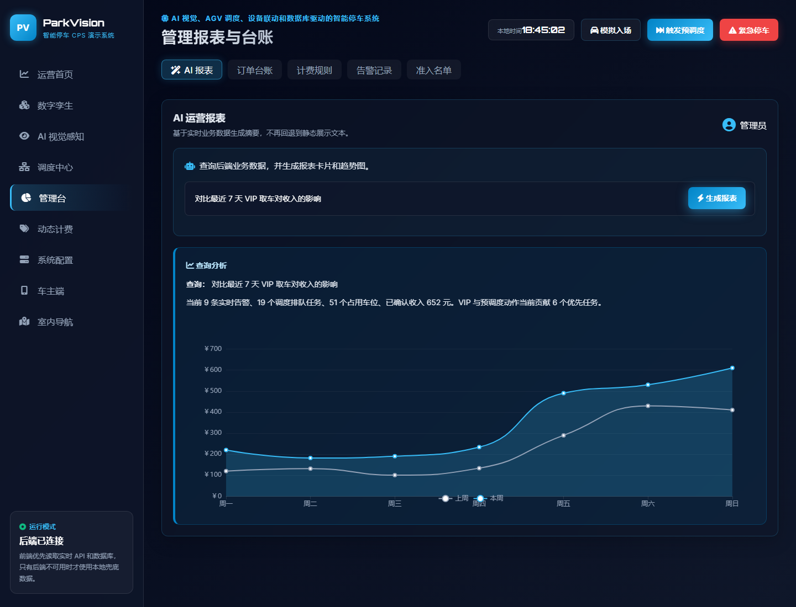

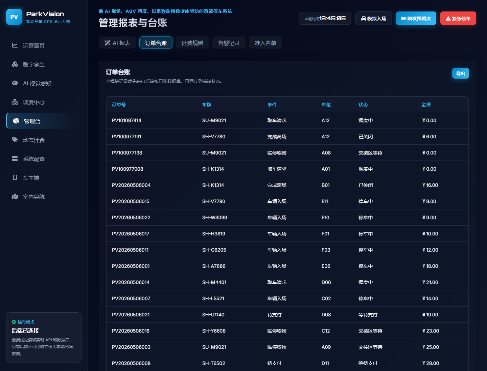

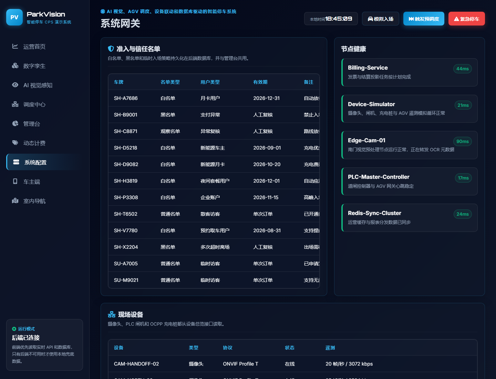

### 6.5 自动化功能测试结果

| 编号 | 测试项 | 预期结果 | 实际结果 | 结论 |
|---|---|---|---|---|
| F-00 | 服务健康检查 | 后端健康状态返回 `UP`，核心业务接口可访问 | `UP` | 通过 |
| F-01 | 模拟入场创建订单并占用车位 | 订单数增加，新增订单状态为 `PARKED`，车位不再为空 | 订单创建成功，车位状态变为 `occupied` | 通过 |
| F-02 | 预调度插入队列 | 调度队列头部新增高峰预调度任务 | 队列新增预调度任务 | 通过 |
| F-03 | VIP 取车插队 | 指定订单变为 `RETRIEVING`，VIP 任务进入队列头部 | VIP 任务进入队列 | 通过 |
| F-04 | 临时取物 Touch-and-Go | 订单变为 `TOUCHING`，车位变为 `BUFFER` | 订单和车位状态同步变化 | 通过 |
| F-05 | 支付完成并关闭订单 | 订单变为 `FINISHED`，车位释放，金额计算 | 金额生成，车位释放为空位 | 通过 |
| F-06 | AI 识别正常流程 | 返回 OCR 结果，系统不进入急停 | 返回车牌、置信度和动作建议 | 通过 |
| F-07 | AI 入侵触发急停 | 摄像头 ROI、闸机、系统节点联动变化 | 急停生效，节点 warning | 通过 |
| F-08 | 人工解除急停 | 闸机急停位恢复，系统回到自动模式 | 急停解除 | 通过 |
| F-09 | 动态计费预览 | 返回订单、时长、费用组成和总金额 | 返回费用组成和总金额 | 通过 |
| F-10 | 室内接驳导航 | 返回接驳点、距离、ETA、安全提示 | 返回完整导航快照 | 通过 |
| F-11 | 管理台 AI 报表 | 返回摘要和收入曲线数据 | 返回中文摘要和图表数据 | 通过 |

## 7. 静态测试

### 7.1 前端静态测试

| 检查项 | 检查内容 | 结果 |
|---|---|---|
| 路由完整性 | 覆盖运营首页、AI、调度、孪生、管理台、计费、系统配置、车主端、室内导航 | 通过 |
| 数据来源 | Store 优先调用后端 API，失败时才使用兜底数据 | 通过 |
| 页面中文化 | 侧边栏、标题、按钮、表格、状态、提示信息均已中文化 | 通过 |
| 构建能力 | `npm run build` 可完成生产构建 | 通过 |
| 前端单元测试 | `npm test -- --run` 可通过 | 通过 |
| 截图脚本 | Playwright 能打开各页面并生成截图证据 | 通过 |

### 7.2 后端静态测试

| 检查项 | 检查内容 | 结果 |
|---|---|---|
| 分层结构 | Controller、Service、Repository 分层清晰 | 通过 |
| 数据访问 | Repository 负责 H2 文件数据库读取和写入 | 通过 |
| 初始数据 | 首次启动自动写入车位、订单、设备、规则、名单等数据 | 通过 |
| 异常处理 | 非法订单和缺参请求统一返回结构化错误 | 通过 |
| 服务层测试 | `.\mvnw.cmd test` 可通过 5 个测试 | 通过 |
| 设备模拟 | 摄像头、闸机、充电桩、AGV 状态由后端集中生成 | 通过 |

### 7.3 自动化脚本检查

| 脚本 | 用途 | 输出 |
|---|---|---|
| `scripts/testing/collect-system-test-data.mjs` | 调用后端接口并采集系统测试数据 | `docs/testing/assets/data/system-test-results.json` |
| `scripts/testing/benchmark-api.mjs` | 对关键 API 做并发性能测试 | `docs/testing/assets/data/performance-summary.json` 与性能图 |
| `scripts/testing/generate-supporting-figures.mjs` | 生成报告用流程图、数据图、结果图 | `docs/testing/assets/figures/*.svg` |
| `scripts/testing/capture-screenshots.mjs` | 截取前端真实页面 | `docs/testing/assets/screenshots/*.png` |
| `scripts/testing/render-markdown-pdf.mjs` | 将 Markdown 报告渲染为 HTML 和 PDF | `docs/testing/ParkVision系统测试报告.html` 与 PDF |
| `scripts/testing/generate-ppt-reference-assets.mjs` | 生成 PPT 可选表格素材 | `docs/testing/assets/ppt/*.svg` 与 PNG |

## 8. 黑盒测试

### 8.1 等价类列表

| 输入条件 | 有效等价类 | 无效等价类 |
|---|---|---|
| 订单号 | 数据库中存在的订单号，如 `PV20260506015` | 不存在或格式错误，如 `ORDER-404` |
| 订单动作 | 取车、临时取物、支付关闭 | 不存在的动作或状态不允许的动作 |
| AI 推理参数 | `cameraId` 存在，`intrusion` 为 `true` 或 `false` | `cameraId` 为空或 `intrusion` 类型错误 |
| 急停接口 | `active=true` 或 `active=false` | 缺少 `active` 必填参数 |
| 计费预览 | 存在订单或默认有效订单 | 不存在订单号 |
| 室内导航 | 存在订单并能映射车位和接驳点 | 不存在订单号 |
| 管理报表 | 中文运营问题或默认查询 | 空查询仍返回默认摘要，不阻断页面 |

### 8.2 有效等价类测试套件

| 测试数据 | 预期结果 | 实际输出 | 覆盖范围 |
|---|---|---|---|
| 创建订单：车牌 `SH-K1314`，存在空闲车位 | 订单创建成功并占用车位 | 返回 `PARKED` 订单，空位减少 | 订单号、车位状态 |
| VIP 取车：对活动订单执行 VIP 优先 | 订单进入 `RETRIEVING`，队列头部新增 VIP 任务 | 返回 VIP 优先取车任务 | 订单动作、调度队列 |
| 临时取物：对活动订单执行 `touch-and-go` | 订单 `TOUCHING`，车位 `BUFFER` | 返回临停取物任务和缓冲车位状态 | 订单动作、车位状态 |
| AI 正常识别：`intrusion=false` | 返回车牌和允许入场动作 | 返回 OCR 置信度和 `ALLOW_ENTRY` 动作 | AI 参数 |
| 管理台报表：查询最近 7 天收入 | 返回摘要和图表数据 | 返回中文摘要、labels 和收入数组 | 报表查询 |

### 8.3 无效等价类测试套件

| 编号 | 测试数据 | 预期结果 | 实际输出 | 结论 |
|---|---|---|---|---|
| B-01 | 非法订单号 `ORDER-404` 调用取车 | `400 + ORDER_NOT_FOUND` | 返回结构化错误 `ORDER_NOT_FOUND` | 通过 |
| B-02 | 非法订单号 `ORDER-404` 调用 VIP | `400 + ORDER_NOT_FOUND` | 返回结构化错误 `ORDER_NOT_FOUND` | 通过 |
| B-03 | 非法订单号 `ORDER-404` 调用计费预览 | `400 + ORDER_NOT_FOUND` | 返回结构化错误 `ORDER_NOT_FOUND` | 通过 |
| B-04 | 非法订单号 `ORDER-404` 调用室内导航 | `400 + ORDER_NOT_FOUND` | 返回结构化错误 `ORDER_NOT_FOUND` | 通过 |
| B-05 | 急停接口缺少 `active` 参数 | `400 + VALIDATION_FAILED` | 返回 `active parameter is required` | 通过 |

## 9. 白盒测试

### 9.1 订单状态控制流

OrderService 的核心测试对象是订单状态变更。测试覆盖取车、临时取物、支付完成和订单不存在异常路径。

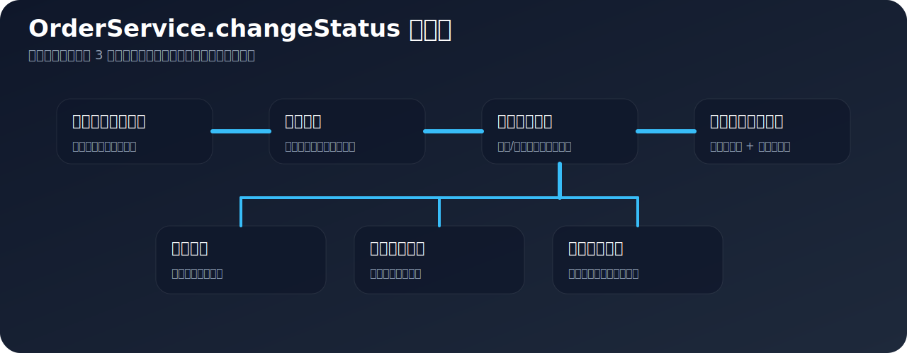

| 分支 | 输入条件 | 预期动作 | 观测结果 |
|---|---|---|---|
| 取车分支 | 有效订单，目标状态为 `RETRIEVING` | 插入标准取车队列 | 生成取车调度任务 |
| 临取分支 | 有效订单，目标状态为 `TOUCHING` | 车位切换为 `BUFFER`，插入临取任务 | 订单和车位状态同步变化 |
| 支付分支 | 有效订单，目标状态为 `FINISHED` | 计算金额，释放车位 | 订单关闭，车位为空 |
| 异常分支 | 不存在订单号 | 抛出 `ORDER_NOT_FOUND` | 返回结构化错误 |

### 9.2 急停控制流

DeviceService 的核心测试对象是急停控制。测试覆盖 AI 入侵触发、人工急停、解除急停和缺参异常路径。

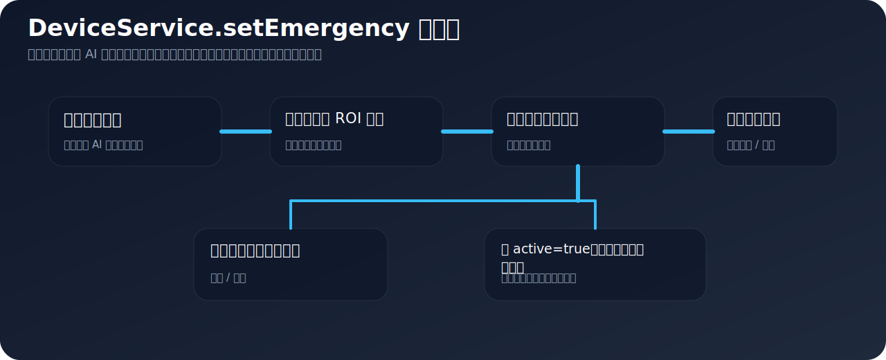

| 分支 | 输入条件 | 预期动作 | 观测结果 |
|---|---|---|---|
| 开启急停 | `active=true` | 摄像头 ROI 风险、闸机锁定、节点 warning、告警新增 | 急停状态可在数字孪生和系统配置页看到 |
| 解除急停 | `active=false` | 闸机恢复、节点恢复稳定、事件记录解除动作 | 系统回到自动模式 |
| AI 入侵 | `intrusion=true` | 走急停联动逻辑 | 摄像头、闸机、节点联动变化 |
| 缺参异常 | 缺少 `active` | 返回 `VALIDATION_FAILED` | 黑盒用例 B-05 通过 |

### 9.3 白盒测试用例与条件覆盖

| 用例ID | 输入 | 期望输出 | 订单存在 | 取车分支 | 临取分支 | 支付分支 | 车位释放 | 急停开启 | 急停解除 | 缺参异常 |
|---|---|---|---|---|---|---|---|---|---|---|
| W1 | 有效订单 + 取车 | 生成取车任务 | T | T | F | F | F | / | / | / |
| W2 | 有效订单 + 临时取物 | 生成临取任务，车位 `BUFFER` | T | F | T | F | F | / | / | / |
| W3 | 有效订单 + 支付完成 | 订单关闭，车位释放 | T | F | F | T | T | / | / | / |
| W4 | 不存在订单 | 抛出 `ORDER_NOT_FOUND` | F | / | / | / | / | / | / | / |
| W5 | `active=true` | 摄像头、闸机、节点、告警联动 | / | / | / | / | / | T | F | F |
| W6 | `active=false` | 设备恢复自动模式 | / | / | / | / | / | F | T | F |
| W7 | 缺少 `active` | 返回 `VALIDATION_FAILED` | / | / | / | / | / | F | F | T |

## 10. 非功能测试

### 10.1 性能测试方法

| 参数 | 设置 | 说明 |
|---|---|---|
| 线程数 | 1、5、20、100 级别并发 | 模拟单人演示到多人同时访问的压力 |
| Ramp-Up 时间 | 1 到 10 秒 | 避免瞬时启动造成非业务性抖动 |
| 循环次数 | 每个场景多轮请求 | 统计平均响应、P95 和成功率 |
| 测试对象 | 运营汇总、调度队列、设备总览、计费预览、管理报表、视觉推理 | 覆盖演示最常访问接口 |

### 10.2 性能测试结果

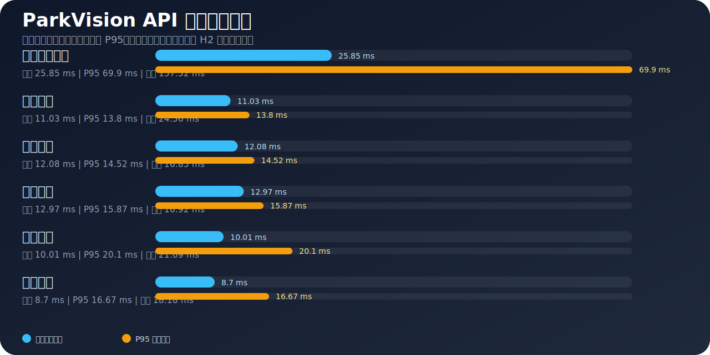

| 场景 | 方法 | 接口路径 | 说明 |
|---|---|---|---|
| 运营首页汇总 | GET | `/api/dashboard/summary` | 读取 KPI、车位、交通预测和事件流 |
| 调度队列 | GET | `/api/dispatch/queue` | 读取实时调度队列和 AGV 任务 |
| 设备总览 | GET | `/api/devices/overview` | 读取摄像头、闸机、充电桩与事件 |
| 计费预览 | GET | `/api/pricing/preview` | 读取默认订单的动态计费结果 |
| 管理报表 | POST | `/api/admin/report` | 生成中文 AI 运营报表和趋势曲线 |
| 视觉推理 | POST | `/api/edge/vision/infer` | 模拟边缘视觉识别与安全联动 |

| 场景 | 请求数 | 并发数 | 最小响应 | 平均响应 | P95 | 最大响应 | 成功率 |
|---|---:|---:|---:|---:|---:|---:|---:|
| 运营首页汇总 | 60 | 10 | 11.39 ms | 35.81 ms | 89.34 ms | 190.49 ms | 100% |
| 调度队列 | 60 | 10 | 5.79 ms | 14.22 ms | 21.89 ms | 27.66 ms | 100% |
| 设备总览 | 60 | 10 | 9.49 ms | 16.50 ms | 18.41 ms | 42.37 ms | 100% |
| 计费预览 | 60 | 10 | 11.39 ms | 21.82 ms | 39.08 ms | 49.79 ms | 100% |
| 管理报表 | 30 | 5 | 5.08 ms | 9.71 ms | 20.73 ms | 22.15 ms | 100% |
| 视觉推理 | 30 | 3 | 4.70 ms | 6.92 ms | 8.78 ms | 9.51 ms | 100% |

### 10.3 可靠性与可恢复性

| 测试点 | 验证方式 | 结果 |
|---|---|---|
| 一键启动 | 使用 `start.ps1` 启动前后端 | 通过 |
| 健康检查 | 后端 `/actuator/health` 返回 `UP` | 通过 |
| 持久化 | H2 文件数据库保存订单、车位、设备状态 | 通过 |
| 急停恢复 | `active=true` 后再 `active=false` | 通过 |
| 前端容错 | Store 有 API 失败兜底逻辑 | 通过 |
| 数据可观测 | 设备、节点、事件、告警可视化展示 | 通过 |

### 10.4 安全与异常处理

| 测试点 | 验证方式 | 结果 |
|---|---|---|
| 输入校验 | 急停接口缺少 `active` 时返回 `VALIDATION_FAILED` | 通过 |
| 业务异常 | 不存在订单统一返回 `ORDER_NOT_FOUND` | 通过 |
| 错误信息 | 接口返回结构化 JSON，不暴露后端堆栈 | 通过 |
| 安全联动 | AI 入侵或人工急停会锁定闸机和节点状态 | 通过 |
| 当前边界 | 未接入登录鉴权，生产化需要补角色权限、审计和限流 | 待扩展 |

## 11. 可用性测试

### 11.1 导航性

| 检查项 | 结果 |
|---|---|
| 左侧导航覆盖 9 个页面 | 通过 |
| 页面标题和功能入口均为中文 | 通过 |
| 顶部保留刷新、急停、演示动作等关键操作 | 通过 |
| 管理台、车主端、调度中心路径清晰 | 通过 |

### 11.2 可视性

| 页面 | 可视化内容 | 结果 |
|---|---|---|
| 运营首页 | KPI、车位状态、交通预测、事件流 | 通过 |
| AI 感知 | 摄像头推理、车牌识别、入侵检测 | 通过 |
| 调度中心 | 实时队列、AGV 状态、闸机条件、充电桩条件 | 通过 |
| 数字孪生 | 车位布局、AGV 坐标、急停状态 | 通过 |
| 管理台 | 订单表、报表摘要、收入曲线 | 通过 |
| 系统配置 | 节点健康、摄像头、闸机、充电桩、事件 | 通过 |

### 11.3 交互友好性

| 场景 | 操作 | 反馈 | 结果 |
|---|---|---|---|
| 车主取车 | 点击取车按钮 | 订单状态进入取车，队列新增任务 | 通过 |
| 临时取物 | 点击临停取物 | 车位进入缓冲区，导航提示接驳点 | 通过 |
| 管理报表 | 输入中文问题并生成 | 返回摘要和曲线数据 | 通过 |
| AI 推理 | 点击采集画面或检测入侵 | 返回 OCR 或急停联动 | 通过 |
| 急停恢复 | 点击解除急停 | 设备和节点恢复稳定 | 通过 |

## 12. 截图证据

| 页面 | 截图路径 | 说明 |
|---|---|---|
| 运营首页 | `assets/screenshots/dashboard.png` | KPI、车位、预测、事件流 |
| AI 感知 | `assets/screenshots/ai-vision.png` | 识别结果、摄像头、推理动作 |
| 调度中心 | `assets/screenshots/dispatch.png` | 实时调度队列、AGV、设备条件 |
| 数字孪生 | `assets/screenshots/twin.png` | 正常孪生状态 |
| 急停状态 | `assets/screenshots/twin-emergency.png` | 急停后的安全联动 |
| 管理报表 | `assets/screenshots/admin-report.png` | AI 报表和收入曲线 |
| 管理订单 | `assets/screenshots/admin-orders.png` | 订单台账 |
| 计费引擎 | `assets/screenshots/pricing.png` | 计费预览和规则 |
| 系统配置 | `assets/screenshots/system.png` | 设备和节点状态 |
| 车主端 | `assets/screenshots/owner.png` | 取车、临取、支付动作 |
| 室内导航 | `assets/screenshots/indoor-map.png` | 接驳路线和 ETA |

## 13. 测试发现与修复

| 编号 | 问题 | 发现方式 | 影响 | 修复结果 |
|---|---|---|---|---|
| BUG-01 | 急停接口缺少 `active` 参数时返回 500 | 黑盒异常测试 | 缺参请求不应暴露服务端错误 | 已增加缺参异常处理，返回 `400 + VALIDATION_FAILED` |
| BUG-02 | 设备事件 ID 在并发场景下可能碰撞 | 性能测试 | 并发写入时事件记录可能冲突 | 已增加随机后缀，避免 ID 碰撞 |
| BUG-03 | 早期截图中运营首页、AI 页面、调度队列为空 | 人工复查截图 | 汇报时无法证明真实数据 | 已重新生成数据和截图，页面均有真实后端数据 |
| BUG-04 | 早期急停截图与正常数字孪生过于相似 | 人工复查截图 | 安全联动效果不明显 | 已重新触发急停并截图，急停状态明显可见 |
| BUG-05 | PPT 表格素材文字可能溢出单元格 | PPT 制作复查 | 队友制作 PPT 时排版不可用 | 已修复 SVG 换行逻辑并重新生成素材 |

## 14. 测试结论

ParkVision 当前已经完成系统测试闭环。前端页面读取后端真实业务数据，订单、车位、调度、设备、计费、导航和管理台之间可以联动；数据库默认使用 H2 文件数据库持久化，仓库拉取后可直接启动并自动初始化；设备侧通过后端模拟摄像头、闸机、充电桩和 AGV 的真实协议风格字段参与演示。

| 测试类别 | 通过情况 | 结论 |
|---|---:|---|
| 功能性测试 | 12/12 | 通过 |
| 黑盒异常测试 | 5/5 | 通过 |
| 白盒分支测试 | 7/7 | 通过 |
| 性能测试 | 6/6 场景成功率 100% | 通过 |
| 静态测试 | 前后端与脚本检查通过 | 通过 |
| 可用性测试 | 主要页面截图和交互链路完整 | 通过 |

后续生产化建议继续补充登录鉴权、角色权限、接口限流、审计日志、端到端自动化测试和真实 MySQL 部署。但以本次系统测试汇报为目标，当前版本已经满足“真实数据、真实数据库、接口联动、报告与截图证据完整”的要求。
